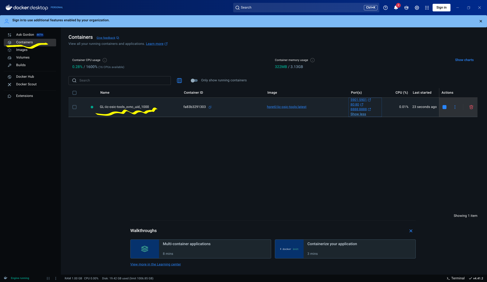
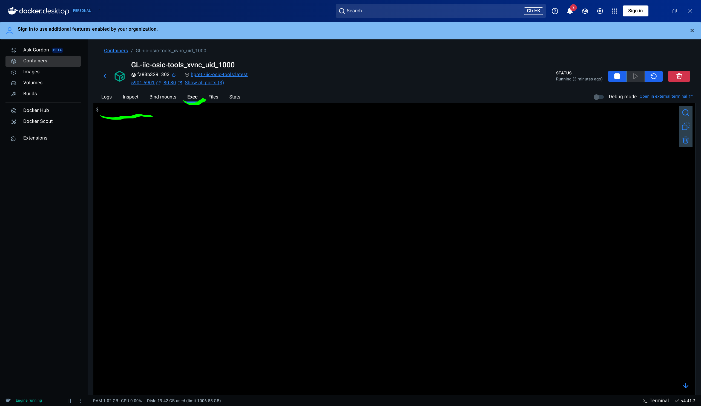
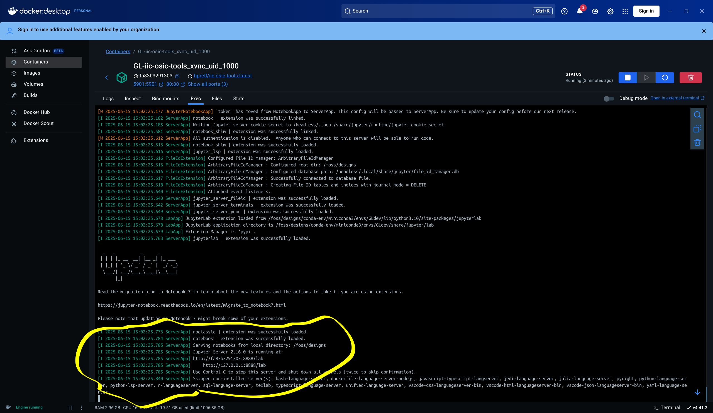

Open Docker-Desktop Dashboard. Go to the *Containers* tab and you should see the container running. 

- Click on container name `GL-iic-.. `

    

- navigate to `Exec` tab

     
- In the Exec terminal (terminal of the Docker)
    - Run `chmod +x ./run_GL.sh`
    - Run `./run_Gl.sh`

  

- This will setup and install necessary components for the gLayout and will start a jupyter server to access it. You can access the Jupyter Server from your browser `http://localhost:8888/lab`

    

Please note you would need to restart the jupyter server if you close or rebuild the docker container.
